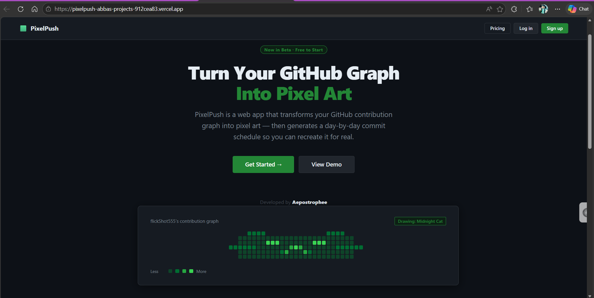
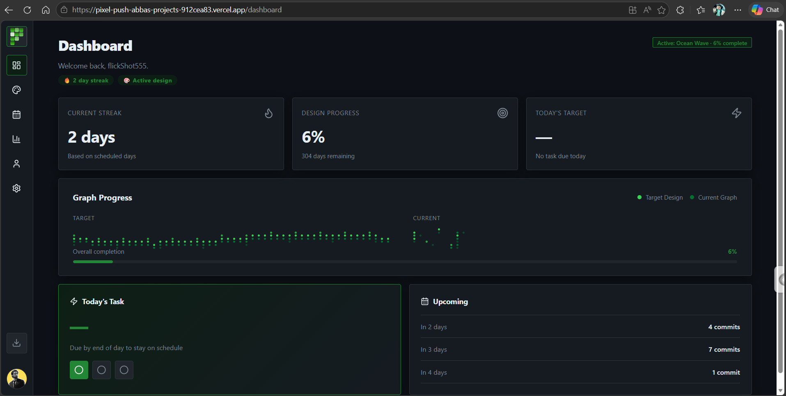
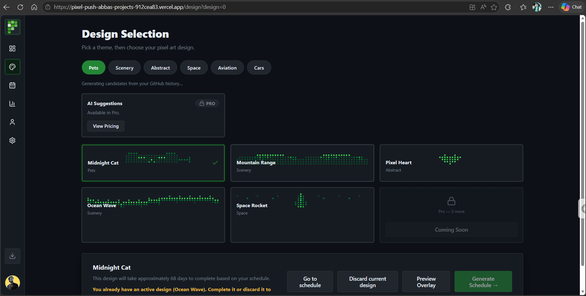
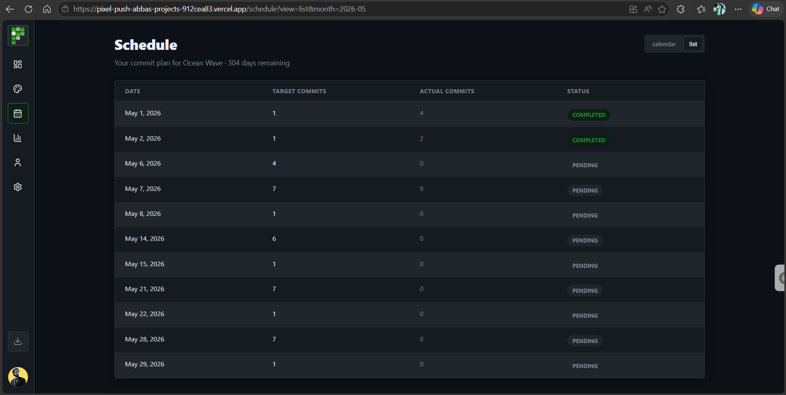
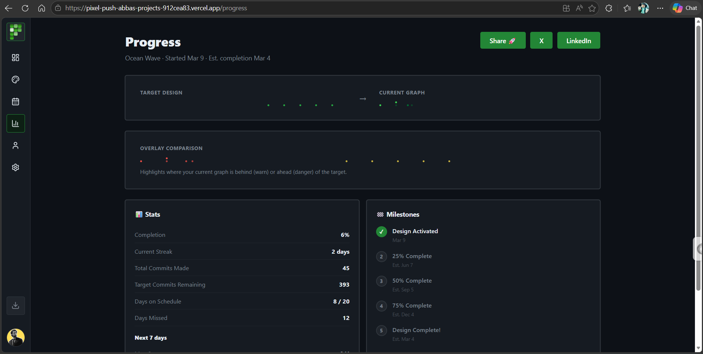
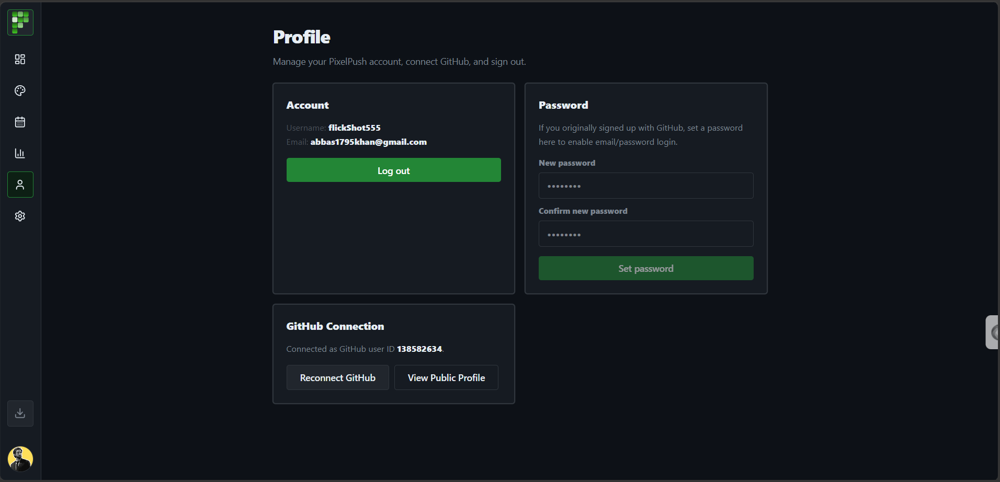

<div align="center">


# 🟩 PixelPush

### Turn Your GitHub Contribution Graph Into Pixel Art

[](https://pixel-push-abbas-projects-912cea83.vercel.app)
[](https://nextjs.org)
[](https://typescriptlang.org)
[](https://vercel.com)
[](LICENSE)

**PixelPush reads your GitHub graph, generates pixel art designs,
and gives you a day-by-day commit schedule to draw them. For real.**

[Try it free →](https://pixel-push-abbas-projects-912cea83.vercel.app) · [Report a bug](https://github.com/aepostrophee/pixelpush/issues) · [Request a feature](https://github.com/aepostrophee/pixelpush/issues)

</div>

---

## What It Does

Your GitHub contribution graph is a 52×7 grid of green squares. Five shade levels. 364 days. Most developers treat it as a byproduct. PixelPush treats it as a canvas.

1. **Connect GitHub** — Link your account. PixelPush reads your real contribution calendar via the GitHub GraphQL API.
2. **Pick a design** — Choose a theme. Get 5 AI-generated pixel art candidates matched to your exact graph dimensions.
3. **Follow the schedule** — Get a day-by-day commit plan. Make real commits to real repos. Watch your graph draw itself.

---

## Screenshots

| Landing | Dashboard | Design Selection |
|---|---|---|
|  |  |  |

| Schedule | Progress | Public Profile |
|---|---|---|
|  |  |  |

---

## Tech Stack

| Layer | Technology |
|---|---|
| **Framework** | Next.js 14 (App Router) |
| **Language** | TypeScript |
| **Styling** | Tailwind CSS + CSS Variables |
| **Auth** | NextAuth.js (Credentials + GitHub OAuth) |
| **Database** | PostgreSQL via Prisma ORM (Neon) |
| **AI** | Groq API (Llama 3.1 8B) |
| **Payments** | Paddle Billing |
| **Deployment** | Vercel |
| **PWA** | Web App Manifest + Service Worker |

---

## Features

### Free Tier
- ✅ GitHub OAuth — connect and read your real contribution graph
- ✅ 5 pixel art candidates per theme (Pets, Scenery, Abstract)
- ✅ AI-generated design suggestions based on your repos and languages
- ✅ Day-by-day commit schedule generation
- ✅ Real-time progress tracking
- ✅ Public profile page at `/u/username`
- ✅ Social share cards (Open Graph)
- ✅ PWA — installable on desktop and mobile

### Pro Tier
- ✅ 3 design slots — save and switch between designs
- ✅ Unlimited schedule recalculation
- ✅ All themes including Space, Aviation, Cars
- ✅ 8 image suggestions per theme
- ✅ AI project suggestions matched to your tech stack
- ✅ Paddle customer portal (manage/cancel subscription)

---

## The Hard Part

The interesting engineering problem in PixelPush is the schedule generation algorithm.

GitHub never publicly documents how commit counts map to shade levels — the thresholds are relative per user and per time period. To solve this:

1. Read the user's full contribution calendar including actual hex color values via GraphQL
2. Reverse-engineer the shade level (0–4) from the returned hex color
3. Map the pixel art design onto the 52×7 grid
4. Calculate the exact commit count needed per day to hit each target shade level
5. Account for existing commits in the current week (locked pixels)
6. Distribute the schedule across available days respecting weekends

The result is a commit plan that, when followed, produces the target pixel art on the user's live GitHub profile.

---

## Project Structure

```
pixelpush/
├── app/
│   ├── api/
│   │   ├── auth/          # NextAuth configuration
│   │   ├── checkout/      # Paddle checkout session
│   │   ├── design/        # Design generation + activation
│   │   ├── github/        # GitHub API integration
│   │   ├── progress/      # Progress tracking
│   │   ├── schedule/      # Schedule generation + sync
│   │   ├── share-card/    # OG image generation
│   │   ├── suggestions/   # Groq AI suggestions
│   │   ├── trial/         # Free trial management
│   │   └── webhook/       # Paddle webhook handler
│   ├── dashboard/         # Main dashboard
│   ├── design/            # Design selection
│   ├── onboarding/        # Mode selection (Dev/Creative)
│   ├── pricing/           # Pricing page
│   ├── progress/          # Progress details
│   ├── schedule/          # Schedule view
│   ├── settings/          # Account settings
│   └── u/[username]/      # Public profile page
├── components/
│   ├── ui/                # Shared UI components
│   ├── landing/           # Landing page components
│   └── pwa/               # PWA install prompt
├── lib/
│   ├── auth.ts            # NextAuth configuration
│   ├── check-plan.ts      # Pro feature gating
│   ├── github.ts          # GitHub API client
│   ├── graph-utils.ts     # Graph data generators
│   ├── paddle.ts          # Paddle client
│   ├── prisma.ts          # Prisma client
│   ├── schedule.ts        # Schedule generation algorithm
│   └── theme.tsx          # Theme system (Dev/Creative)
├── prisma/
│   └── schema.prisma      # Database schema
└── docs/
    ├── feature-audit.md   # Feature completeness audit
    ├── e2e-flows.md       # End-to-end flow documentation
    └── paddle-audit.md    # Paddle integration audit
```

---

## Getting Started

### Prerequisites

- Node.js 18+
- PostgreSQL database (Neon recommended)
- GitHub OAuth App
- Groq API key (free tier)
- Paddle account (sandbox for development)

### Installation

```bash
# Clone the repository
git clone https://github.com/aepostrophee/pixelpush.git
cd pixelpush

# Install dependencies
npm install

# Set up environment variables
cp .env.example .env
# Fill in your values — see Environment Variables section below

# Run database migrations
npx prisma migrate dev

# Start development server
npm run dev
```

Open [http://localhost:3000](http://localhost:3000).

### Environment Variables

```bash
# Database
DATABASE_URL=                          # Neon PostgreSQL connection string

# NextAuth
AUTH_SECRET=                           # Generate: openssl rand -base64 32
NEXTAUTH_URL=http://localhost:3000     # Change to production URL on deploy

# GitHub OAuth (create at github.com/settings/developers)
GITHUB_CLIENT_ID=
GITHUB_CLIENT_SECRET=

# Groq AI (free at console.groq.com)
GROQ_API_KEY=

# Paddle Billing (sandbox at paddle.com)
PADDLE_API_KEY=
PADDLE_WEBHOOK_SECRET=
NEXT_PUBLIC_PADDLE_CLIENT_TOKEN=
NEXT_PUBLIC_PADDLE_PRO_PRICE_ID=
NEXT_PUBLIC_PADDLE_LIFETIME_PRICE_ID=
NEXT_PUBLIC_PADDLE_ENV=sandbox

# Launch settings
NEXT_PUBLIC_LAUNCH_TRIAL=true          # Auto-give new users 7-day Pro trial
NEXT_PUBLIC_LEGAL_DRAFT=true           # Show placeholder warning on legal pages
```

---

## Roadmap

- [ ] Push notifications (Web Push API)
- [ ] Email digest — daily commit reminders
- [ ] Timelapse GIF export
- [ ] Custom image upload
- [ ] Watermark-free share cards
- [ ] Org and team graph support
- [ ] Admin dashboard
- [ ] Account deletion
- [ ] GitHub disconnect / token revocation

---

## Contributing

This is a solo project in active development. Issues and feature requests are welcome. If you find a bug please open an issue with steps to reproduce.

---

## License

MIT — see [LICENSE](LICENSE) for details.

---

<div align="center">

Built by [Aepostrophee](https://aepostrophee.com) · [Live Demo](https://pixel-push-abbas-projects-912cea83.vercel.app) · [LinkedIn](https://linkedin.com/company/aepostrophee)

If you found this interesting, give it a ⭐ — it helps more developers find it.

</div>
